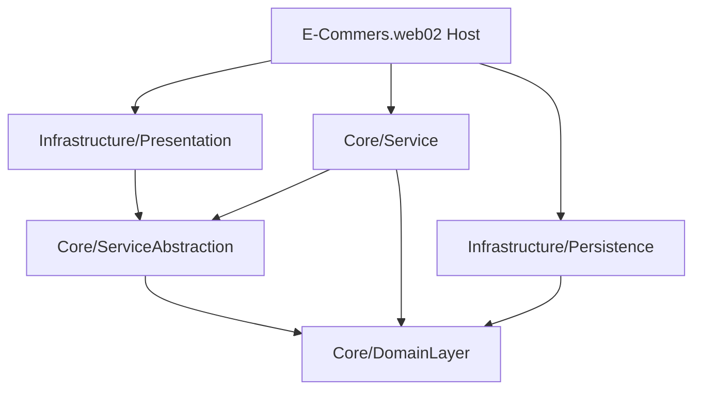

# E_Commers.web


A modern E-commerce Web API engineered with .NET 8, implementing Clean Architecture/Onion Architecture. The system provides a scalable product catalog featuring product brands, types, and generic base entities following Domain-Driven Design concepts.

## 🏗️ Architecture



## 📂 Project Structure

| Layer | Project | Description |
|---|---|---|
| **Domain** | `Core/DomainLayer` | Entities (`BaseEntity`, `Product`, `ProductBrand`, `ProductType`). |
| **Service Interfaces** | `Core/ServiceAbstraction` | Abstractions and contracts for domain services. |
| **Service Implementation** | `Core/Service` | Business logic and use case implementations. |
| **Data Access** | `Infrastructure/Persistence` | EF Core integrations targeting SQL Server. |
| **API** | `Infrastructure/Presentaion` | Controller logic separating routing from business rules. |
| **Shared** | `Shared/Shared` | Cross-cutting concerns and shared models. |
| **Host** | `E-Commers.web02` | Startup, configuration, and API bootstrapping. |

## 🚀 Getting Started

### Prerequisites
- [.NET 8 SDK](https://dotnet.microsoft.com/download/dotnet/8.0)
- SQL Server

### Installation & Execution

```bash
# 1. Clone the repository
git clone https://github.com/OmarAlfar0uk/E_Commers.web.git

# 2. Navigate to the project root
cd E_Commers.web

# 3. Restore dependencies
dotnet restore

# 4. Run the application
dotnet run --project E-Commers.web02
```

---

## 👨‍💻 Author

**Omar Alfarouk**
- GitHub: [OmarAlfar0uk](https://github.com/OmarAlfar0uk)
- LinkedIn: [omar-alfarouk-252471251](https://www.linkedin.com/in/omar-alfarouk-252471251/)
- Email: [omaralfarouk646@gmail.com](mailto:omaralfarouk646@gmail.com)
