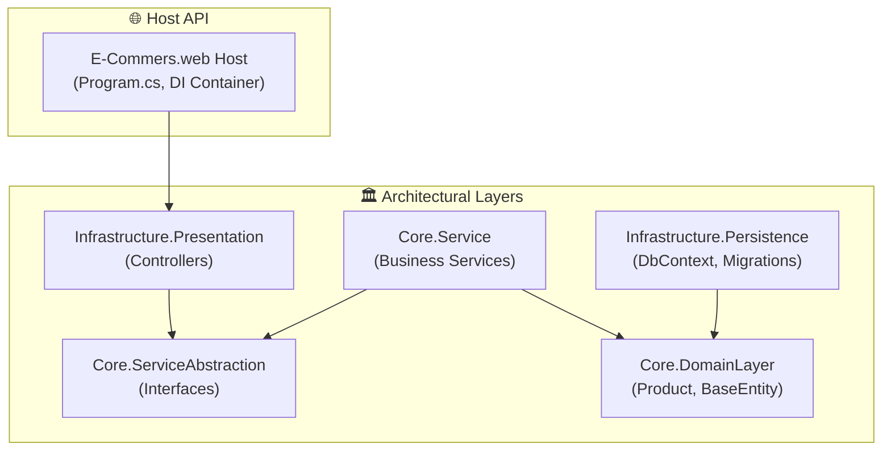

<div align="center">

# 🛒 E_Commers.web
### Scalable E-Commerce Web API Solution Architected with Clean Onion Architecture

[](https://dotnet.microsoft.com/)
[](https://learn.microsoft.com/en-us/dotnet/csharp/)
[](#-system-architecture)
[](LICENSE)
[](https://github.com/OmarAlfar0uk)

<p align="center">
  <a href="#-key-features">Key Features</a> •
  <a href="#-system-architecture">System Architecture</a> •
  <a href="#-tech-stack">Tech Stack</a> •
  <a href="#-getting-started">Getting Started</a> •
  <a href="#-author">Author</a>
</p>

</div>

---

## 📌 Executive Overview

**E_Commers.web** is a robust e-commerce backend built with ASP.NET Core. Structured around Clean Architecture and the Onion paradigm, it decouples core business domain models and logic from infrastructure, database technologies, and Web presentation components.

> [!NOTE]
> Structured into isolated architectural layers: **Core.DomainLayer**, **Core.ServiceAbstraction**, **Core.Service**, **Infrastructure.Persistence**, and **Infrastructure.Presentation**.

---

## ✨ Key Features

| ⚡ Feature | 💡 Description | 🛠 Engineering Detail |
|---|---|---|
| **📦 Product Catalog Management** | Comprehensive catalog with product specifications and pricing | Relational entity mappings via EF Core |
| **🛡️ Architectural Integrity** | Decoupled dependencies following SOLID principles | Domain layer has zero third-party dependencies |
| **🗄️ Persistence Abstraction** | Generic repository abstractions with Unit of Work pattern | Swappable database layer |
| **🚀 Extensible Web API** | Standardized JSON response envelopes and RESTful endpoints | ASP.NET Core Web API with Swagger |

---

## 🏛 System Architecture



---

## ⚡ Tech Stack

- **Framework:** .NET 8 / C# 12
- **Architecture:** Clean Onion Architecture
- **ORM & Data:** Entity Framework Core / Microsoft SQL Server
- **Tooling:** Swagger / OpenAPI, Visual Studio

---

## 🚀 Getting Started

1. **Clone repository:**
   ```bash
   git clone https://github.com/OmarAlfar0uk/E_Commers.web.git
   cd E_Commers.web
   ```

2. **Build & Launch:**
   ```bash
   dotnet run --project E-Commers.web02/E-Commers.web02.csproj
   ```

---

## 👨‍💻 Author

**Omar Alfarouk**  
*Full-Stack .NET & Software Engineer*  

- 🌐 **GitHub:** [@OmarAlfar0uk](https://github.com/OmarAlfar0uk)
- 💼 **LinkedIn:** [omar-alfarouk](https://www.linkedin.com/in/omar-alfarouk-252471251/)
- 📧 **Email:** [omaralfarouk646@gmail.com](mailto:omaralfarouk646@gmail.com)

---

<div align="center">
  <sub>Built with ❤️ by Omar Alfarouk. Licensed under the <a href="LICENSE">MIT License</a>.</sub>
</div>
